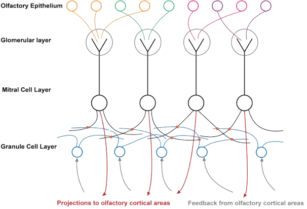
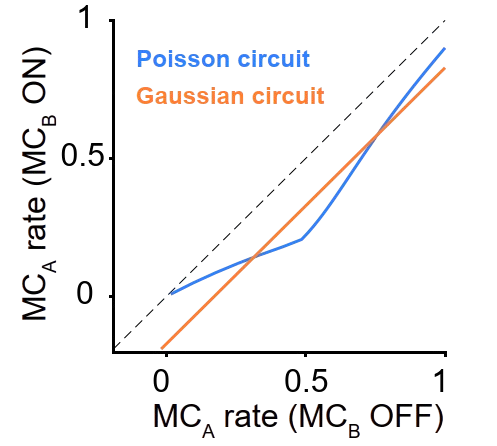
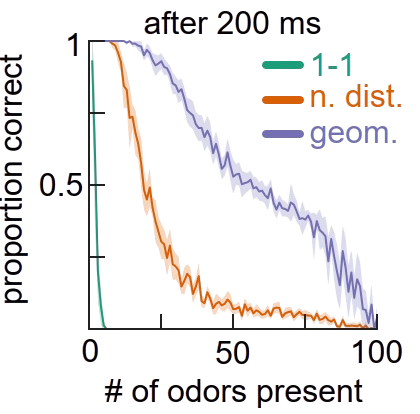
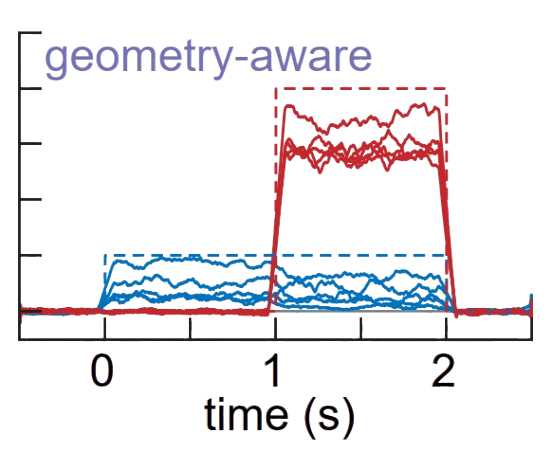

<!-- _class: cover_e -->
<!-- transition: cover -->
<!-- _paginate: "" -->
<!-- _footer:  -->
<!-- _header:  -->

# Neural Circuits for Fast Poisson Compressed Sensing the in the Olfactory Bulb

As reviewed by Chaebeom Sheen
Paper from NeurIPS 2023 
Date: February 7th, 2025
<cauchybs@snu.ac.kr>

## 1. Introduction

<!-- _class: trans -->
<!-- transition: melt -->
<!-- _footer: "" -->
<!-- _paginate: "" -->

## 1. Introduction

<!-- _class: navbar -->
<!-- transition: cover -->
<!-- _header: \ ***@ SNU CN*** **Introduction** *Methods* *Results* *Conclusion*-->

- Vision and audition are the most studied sensory modalities in neuroscience.Encoding for these modalities can be derived from *orientation* or *frequency*, which map directly onto neural representations. 
- The neural encoding of olfaction is less understood. 
- The authors propose a Poisson Compressed Sensing Model to understand the neural encoding of olfaction in the mammalian olfactory bulb (primarily mouse and human). 
  - Why Compressed Sensing?:  With only a few hundred different types of olfactory receptors, humans can distinguish between millions of different odors. 
  - **Strengths**: 
    1. The PCS model *maps directly* onto the circuits of the bulb, without requiring an axis-aligned coding which is biologically implausible. 
    2. The PCS model allows fast, accurate inference by considering the geometry of the olfactory bulb. 
  

## 1. Anatomy of the Olfactory Bulb

<!-- _class: navbar bq-blue-->
<!-- transition: cover -->
<!-- _header: \ ***@ SNU CN*** **Introduction** *Methods* *Results* *Conclusion*-->

## 2. Methods

<!-- _class: trans -->
<!-- transition: melt -->
<!-- _footer: "" -->
<!-- _paginate: "" -->

## 2. Methods

<!-- _class: navbar -->
<!-- transition: cover -->
<!-- _header: \ ***@ SNU CN*** **Introduction** *Methods* *Results* *Conclusion*-->

- An important distinction between Poisson compressed sensing and earlier models is that earlier, Gaussian models assumed axis-aligned coding (where one granular neuron is responsible for one odorant), which is biologically implausible.
- The goal of the PCS model is Bayesian inference of the odorant concentration $\mathbf{c} \in \mathbb{R}^{n_{\text{odor}}}$ given a single spike train in the oral epithelium $\mathbf{s} \in \mathbb{R}^{n_{\text{OSN}}}$.
- It is assumed that the mean activity of the OSN is given by a linear-affine function,
$$ \mathbf{s} | \mathbf{c} \sim \text{Poisson}(\mathbf{r} + \mathbf{A}\mathbf{c}) $$
$$ \mathbf{c} \sim \text{Gamma}(\boldsymbol{\alpha}, \boldsymbol{\lambda}) $$
- Given this likelihood and prior, the MAP (maximum a posteriori) estimate of the concentration is given by gradient ascent as
$$ \dot{\mathbf{c}}(t) = \nabla_{c} \left[\log p(\mathbf{s} | \mathbf{c})p(\mathbf{c})\right] + \boldsymbol{\eta}(t)$$
- Where $\boldsymbol{\eta}(t)$ is $n_{\text{odor}}$-dimensional white noise with zero mean and $\mathbb{E}[\boldsymbol{\eta}_j(t)\boldsymbol{\eta}_{j'}(t')] = 2 \delta_{jj'}\delta(t-t')$.

## 2. Methods

<!-- _class: navbar -->
<!-- transition: cover -->
<!-- _header: \ ***@ SNU CN*** **Introduction** *Methods* *Results* *Conclusion*-->

- Based on our prior and likelihood, computing the gradient of the log posterior is straightforward

$$ \nabla_{\mathbf{c}} \log p(\mathbf{s} | \mathbf{c}) = \mathbf{A}^T\left(\dfrac{\mathbf{s}}{\mathbf{r}+\mathbf{A}\mathbf{c}} - 1 \right) $$
$$ \nabla_{\mathbf{c}} \log p(\mathbf{c}) = \dfrac{\boldsymbol{\alpha} - 1}{\mathbf{c}} - \boldsymbol{\lambda} $$
- However, in this setup there is one-to-one mapping between nurons and odorants. Assume a population $n_g$ of neurons which map to $\mathbf{c}$ through a matrix $\Gamma \in \mathbb{R}^{n_{\text{odor}} \times n_g}$ so that $\mathbf{c} = \Gamma \mathbf{g}$.
- A classic result in stochastic gradient MCMC tells us that given $\Gamma\Gamma^T$ is positive definite and $\tau_g$ is the time constant of the neurons, the following dynamics will converge to a MAP. 
$$ \tau_g \dot{\mathbf{g}}(t) = \Gamma^{T} \nabla_{\mathbf{g}} \log p(\mathbf{g} | \mathbf{s}) + \boldsymbol{\xi}(t) $$
- Inputting the above we have
$$ \tau_g \dot{\mathbf{g}}(t) = (A\Gamma)^{T}\left(\dfrac{\mathbf{s}}{\mathbf{r}+\mathbf{A}\Gamma\mathbf{g}} - 1 \right) + \Gamma^{T}\left(\dfrac{\boldsymbol{\alpha} - 1}{\Gamma\mathbf{g}} - \boldsymbol{\lambda} \right) + \boldsymbol{\xi}(t) $$

## 2. Methods

<!-- _class: navbar -->
<!-- transition: cover -->
<!-- _header: \ ***@ SNU CN*** **Introduction** *Methods* *Results* *Conclusion*-->
- This dynamic system contains divisive non-linearities, which are difficult to simulate. 
- To linearize the system, we introduce two new populations of neurons $\mathbf{p}$ of size $n_{\text{OSN}}$ and $\mathbf{b}$ of size $n_{\text{odor}}$ which have as their fixed points $\dfrac{\mathbf{s}}{\mathbf{r+A\Gamma g}}$ and $\dfrac{\boldsymbol{\alpha} - 1}{\boldsymbol{\Gamma}\mathbf{g}}$ respectively.
- The dynamics of $\mathbf{p}$ and $\mathbf{b}$ are given by
$$ \tau_p \dot{\mathbf{p}}(t) = \mathbf{s} - (\mathbf{r} + \mathbf{A}\Gamma\mathbf{g}) \odot \mathbf{p} $$
$$ \tau_b \dot{\mathbf{b}}(t) = \boldsymbol{\alpha} - 1 - \boldsymbol{\Gamma}\mathbf{g} \odot \mathbf{b} $$
- where $\odot$ is element-wise multiplication. In the steady state regime where $\tau_p, \tau_b \downarrow 0$, the dynamics of $\mathbf{g}$ are given by the initial equation.

## 2. Methods

<!-- _class: navbar -->
<!-- transition: cover -->
<!-- _header: \ ***@ SNU CN*** **Introduction** *Methods* *Results* *Conclusion*-->
- Putting all of this together, the dynamics of the system are given by
$$ \mathbf{c} = \Gamma \mathbf{g} $$
$$ \tau_p \dot{\mathbf{p}}(t) = \mathbf{s} - (\mathbf{r} + \mathbf{A}\Gamma\mathbf{g}) \odot \mathbf{p} $$
$$ \tau_b \dot{\mathbf{b}}(t) = \boldsymbol{\alpha} - 1 - \boldsymbol{\Gamma}\mathbf{g} \odot \mathbf{b} $$
$$ \tau_g \dot{\mathbf{g}}(t) = (A\Gamma)^{T}(p - 1) + \Gamma^{T}(\mathbf{b} - \boldsymbol{\lambda}) + \boldsymbol{\xi}(t) $$
- where $\boldsymbol{\xi}(t)$ is $n_{g}$-dimensional white noise with zero mean and $\mathbb{E}[\boldsymbol{\xi}_j(t)\boldsymbol{\xi}_{j'}(t')] = 2 \tau_g \delta_{jj'}\delta(t-t')$.
- The converge to that MAP is relegated to the appendix, and will not be discussed here.
- The authors show that $\mathbf{p}$, which encodes the divisive difference between prediction and observation, are **projection neurons** (mitral cells), $\mathbf{g}$, which encodes the MAP, are **granular neurons**, and $\mathbf{b}$, which encodes the prior, is **cortical feedback** from the brain. 
- Meanwhile $\mathbf{A}$ encodes the sensitivity of the OSN to the odorant, while $\mathbf{A}\mathbf{\Gamma}$ encodes the synaptic weights of the mitral and granule-cells, coupled by dendrodendritic synapses.

## 2. Methods

<!-- _class: navbar bq-blue-->
<!-- transition: cover -->
<!-- _header: \ ***@ SNU CN*** **Introduction** *Methods* *Results* *Conclusion*-->

## 2. Methods

<!-- _class: navbar -->
<!-- transition: cover -->
<!-- _header: \ ***@ SNU CN*** **Introduction** *Methods* *Results* *Conclusion*-->

- $\mathbf{A}$ can be selected using Calcium imaging.
- The choice of $\Gamma$ is more difficult, as our model contains simplifications. 
- For fast inference, the authors realize that the firing rates of each mitral cell should be independent of the firing of other mitral cells, thus we choose $\Gamma$ so that $\Gamma\Gamma^T = aA^{T}A$ with $a \in \mathbb{R}_{+}$ some constant. This is called **geometry-aware code**, as it respects the geometry of mitral firing. 
- Code which does not satisfy this condition is called **naively-distributed**. As a control, the authors select $\Gamma$ so that $\Gamma\Gamma^T = k\mathbf{I}$. 
- This is further compared with **one-to-one** coding where $\Gamma = \mathbf{I}$ with $n_g = n_{\text{odor}}$.

## 3. Results

<!-- _class: trans -->
<!-- transition: melt -->
<!-- _footer: "" -->
<!-- _paginate: "" -->
## 3. Results: PMC shows state-dependent inhibition
<!-- _class: navbar rows-2-->
<!-- transition: cover -->
<!-- _header: \ ***@ SNU CN*** *Introduction* *Methods* *Results* **Conclusion**-->

## 3. Results: Quick and accurate inference is possible
<!-- _class: navbar rows-2-->
<!-- transition: cover -->
<!-- _header: \ ***@ SNU CN*** *Introduction* *Methods* *Results* **Conclusion**-->

## 3. Results: Dynamic Inference in a noisy world is possible
<!-- _class: navbar rows-2-->
<!-- transition: cover -->
<!-- _header: \ ***@ SNU CN*** *Introduction* *Methods* *Results* **Conclusion**-->

## 4. Conclusion

<!-- _class: trans -->
<!-- transition: melt -->
<!-- _footer: "" -->
<!-- _paginate: "" -->

## 4. Conclusion
<!-- _class: navbar rows-2-->
<!-- transition: cover -->
<!-- _header: \ ***@ SNU CN*** *Introduction* *Methods* *Results* **Conclusion**-->
- The authors demonstrate a Poisson Compressed Sensing model for the olfactory bulb which is both biologically plausible and computationally efficient.
  - The model is based on a Bayesian inference of the MAP of the odorant concentration given a spike train in the olfactory epithelium. 
  - The MAP is found by Langevin dynamics approximating gradient ascent in the granular neurons. 
  - The model respects the anatomy of olfactory bulb, in terms of the dendrodendritic coupling of mitral and granule neurons as well as the synapses in the glomerulus. 
  - Geometry-aware coding is shown to be more efficient than one-to-one coding, and shows Bayesian inference in biological time scales (200ms). 
- Significance
  - The new model naturally respects the microanatomy of the olfactory bulb. 
  - The authors demonstrate distributed coding can lead to faster inference than axis-aligned coding.
- Limitations
  - Synaptic plasticity is not considered, and the way in which $\mathbf{A}$ and $\mathbf{A}\Gamma$ are learned remains unclear. 