<!-- _class: cover_e -->
<!-- transition: cover -->
<!-- _paginate: "" -->
<!-- _footer:  -->
<!-- _header:  -->

# Understanding The Geometry of Abstraction in the Hippocampus

Chaebeom Sheen, Jaejoon Han, Junghwan Kim, Seiok Kim, Seoyeon Han
Paper from Cell, 2020
Date: September 6th, 2025
<cauchybs@snu.ac.kr>

## 1. Introduction

<!-- _class: trans -->
<!-- transition: melt -->
<!-- _footer: "" -->
<!-- _paginate: "" -->

## Geometry of Memory

<!-- _class: navbar -->
<!-- transition: cover -->
<!-- _header: \ ***@ SNU CN*** **Introduction** *In Silico* *In Vivo* *Individuals* *Conclusion*-->
- Both spatial and conceptual entities are linked through paths in the cognitive map.
- How does the cognitive map represent the geometry of the world?
- *More specifically*, what is its dimension?


## Why Dimensionality?

<!-- _class: navbar -->
<!-- transition: cover -->
<!-- _header: \ ***@ SNU CN*** **Introduction** *In Silico* *In Vivo* *Individuals* *Conclusion*-->

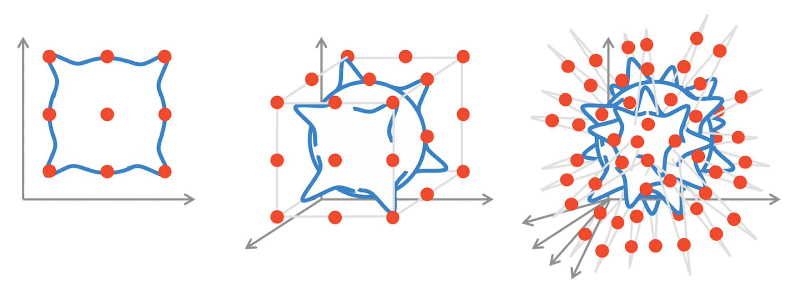

## Disentanglement and Embedding (1)

<!-- _class: navbar -->
<!-- transition: cover -->
<!-- _header: \ ***@ SNU CN*** **Introduction** *In Silico* *In Vivo* *Individuals* *Conclusion*-->


## Disentanglement and Embedding (2)

<!-- _class: navbar -->
<!-- transition: cover -->
<!-- _header: \ ***@ SNU CN*** **Introduction** *In Silico* *In Vivo* *Individuals* *Conclusion*-->

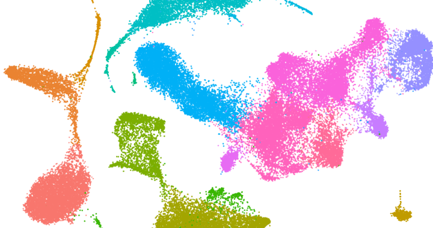

## So what is the paper about?

<!-- _class: navbar bq-blue-->
<!-- transition: cover -->
<!-- _header: \ ***@ SNU CN*** **Introduction** *In Silico* *In Vivo* *Individuals* *Conclusion*-->

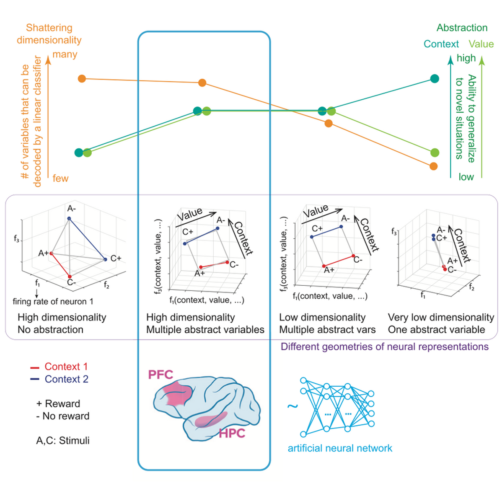

## 2. Methods (in silico)

<!-- _class: trans -->
<!-- transition: melt -->
<!-- _footer: "" -->
<!-- _paginate: "" -->

## How to measure dimensionality and generalization?

<!-- _class: navbar -->
<!-- transition: cover -->
<!-- _header: \ ***@ SNU CN*** *Introduction* **In Silico** *In Vivo* *Individuals* *Conclusion*-->

- Why SD (shattering dimension) and CCGP (cross-condition generalization performance)?
- Two contexts: where A is rewarded (A+, C-) vs  where C is rewarded (C+, A-).
- For a single variable: $(A)$ vs $(B)$ $\leftarrow$ Random Representation vs Clustering
- For multiple variables with mixed selectivity: $(C)$ vs $(D)$ $\leftarrow$ Square vs Twisted Square (Higher SD)


## How to quantify the generalization: Parallelism Score

<!-- _class: navbar -->
<!-- transition: cover -->
<!-- _header: \ ***@ SNU CN*** *Introduction* **In Silico** *In Vivo* *Individuals* *Conclusion*-->

$$
\text{PS} = \max_{\text{Permutations } \mathcal{P}} \langle \cos(\theta) \rangle_{\mathcal{P}}
\approx \text{CCGP}
$$

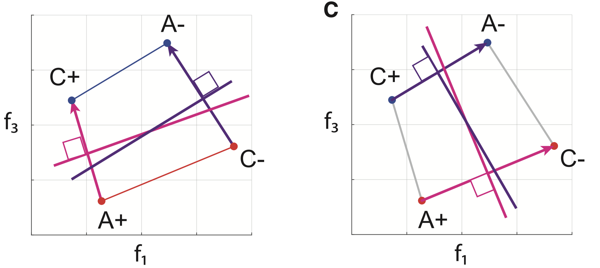

## CCGP and PS in Action: MNIST

<!-- _class: navbar -->
<!-- transition: cover -->
<!-- _header: \ ***@ SNU CN*** *Introduction* **In Silico** *In Vivo* *Individuals* *Conclusion*-->

- Learning on 8 MNIST digits with a FFN, we find that ANNs have high dimensionality (e.g. decoding accuracy). Parity and magnitude are orthogonal and have the most accurate abstract representations (measured by CCGP and PS), when it is the given  task. They are orthogonal in neural representations. 


## CCGP and PS in Action: Colab

<!-- _class: navbar -->
<!-- transition: cover -->
<!-- _header: \ ***@ SNU CN*** *Introduction* **In Silico** *In Vivo* *Individuals* *Conclusion*-->

 

## CCGP in Action: Logistic Regression

<!-- _class: navbar -->
<!-- transition: cover -->
<!-- _header: \ ***@ SNU CN*** *Introduction* **In Silico** *In Vivo* *Individuals* *Conclusion*-->

```python
def compute_ccgp(
    X: vector_rep, y_cond: image_label, var_map: dict,
    conditions = list(range(1, 9)), ratio_train = 0.5
):
    probe = Pipeline(LogisticRegression(solver="liblinear"))
    # set up so probe.fit() fits a regression model
    pos, neg = ([c for c in conditions if var_map[c]==sign] for sign in (1, -1))
    accs = []
    for pos_train in combinations(pos, ratio_train * len(pos)):
        for neg_train in combinations(neg, ratio_train * len(neg)): 
            train_conds = set(pos_train) | set(neg_train) # union
            test_conds  = set(conds) - train_conds # set 
            #mask filters out only train conditions, e.g. 1, 4, 5, 8
            Xtr, Xte, ytr, yte = (X[mask_train_conds], X[mask_test_conds], 
                y_cond[mask_train_conds], y_cond[mask_test_conds])
            probe.fit(Xtr, ytr) #Logistic Regression Fit
            accs.append(accuracy_score(yte, probe.predict(Xte))) # test on new labels
    return float(np.mean(accs)) 
```

## Shattering Dimension (SD) in Action

<!-- _class: navbar -->
<!-- transition: cover -->
<!-- _header: \ ***@ SNU CN*** *Introduction* **In Silico** *In Vivo* *Individuals* *Conclusion*-->

```python
def compute_sd(
    X: vector_rep, y_cond: image_label, var_map: dict,
    conditions = list(range(1, 9)), test_size = 0.4, n_repeats = 3
):
    probe = Pipeline(LogisticRegression(solver="liblinear"))  # identical linear probe
    y = np.array([var_map[c] for c in y_cond])  # map to ±1 labels
    accs = []
    for _ in range(n_repeats):
        # stratified random split across all conditions (1, 2, ... 8)
        Xtr, Xte, ytr, yte = train_test_split(
            X, y, test_size=test_size, stratify=y
        )
        probe.fit(Xtr, ytr)
        accs.append(accuracy_score(yte, probe.predict(Xte))) # test on shown labels 
    return float(np.mean(accs))
```

## Parallelism Score (PS) in Action

<!-- _class: navbar -->
<!-- transition: cover -->
<!-- _header: \ ***@ SNU CN*** *Introduction* **In Silico** *In Vivo* *Individuals* *Conclusion*-->

```python
def compute_ps(X: vector_rep, y_cond: image_label, var_map: dict):
    means = {c: X[y_cond==c].mean(axis=0) for c in np.unique(y_cond)}
    pos, neg = ([c for c in conditions if var_map[c]==sign] for sign in (1, -1))
    P = len(pos) # 4
    pos_mu = np.stack([means[c] for c in pos]) # mean X for label in pos
    neg_mu = np.stack([means[c] for c in neg]) # mean X for label in neg

    def avg_pairwise_cos(vecs):
        dots = [] 
        for i in range(len(vecs)):
            for j in range(i+1, len(vecs)):
                dots.append(float(np.dot(vecs[i], vecs[j])))
        return float(np.mean(dots)) # average cosine similarity

    perms = np.array(list(permutations(range(P))))
    vecs  = pos_mu[None, :] - neg_mu[perms] # average for each permutation
    return max(map(avg_pairwise_cos, vecs))
  ```

## CCGP, SD, and PS in Action (1)

- a simple feedforward network abstracts parity and magnitude well in its hidden layers
- every dichotomy can be decoded (SD is close to $1$)

<!-- _class: navbar -->
<!-- transition: cover -->
<!-- _header: \ ***@ SNU CN*** *Introduction* **In Silico** *In Vivo* *Individuals* *Conclusion*-->


## CCGP, SD, and PS in Action (2)

<!-- _class: navbar -->
<!-- transition: cover -->
<!-- _header: \ ***@ SNU CN*** *Introduction* **In Silico** *In Vivo* *Individuals* *Conclusion*-->

- an initial input representation groups digits which are visually similar together
- we find *magnitude* and *parity* are orthogonal in hidden layer 2. 


## 3. Methods (in vivo)

<!-- _class: trans -->
<!-- transition: melt -->
<!-- _footer: "" -->
<!-- _paginate: "" -->

## Monkey Experiment Setup

<!-- _class: navbar -->
<!-- transition: cover -->
<!-- _header: \ ***@ SNU CN*** *Introduction* *In Silico* **In Vivo** *Individuals* *Conclusion*-->

- stimulus and its operant and reinforcement contingencies (SRO mapping)
- 2 blocks of trials, containing 4 trials each (total of $8$ trials, possible $\frac{1}{2}\binom{8}{4}  = 35$ dichotomies - like MNIST)
- activities of $1378$ neurons in **two monkeys** were recorded ($629$ in HPC, $335$ in ACC, and $414$ in DLPFC)

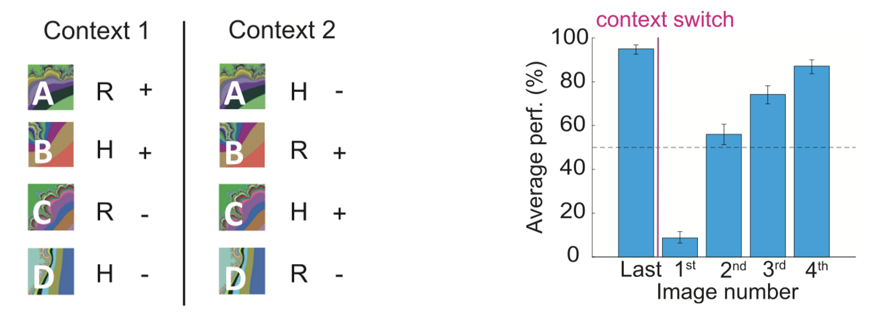

## Monkey Experiment Hypotheses (1)

<!-- _class: navbar -->
<!-- transition: cover -->
<!-- _header: \ ***@ SNU CN*** *Introduction* *In Silico* **In Vivo** *Individuals* *Conclusion*-->

1. Which variables are represented in each area of the brain?
2. Which variables are represented in **abstract format**, as quantified by CGCGP?
3. Does our brain use a *perfectly facotrized representation* or does it use a *twisted square* representation?

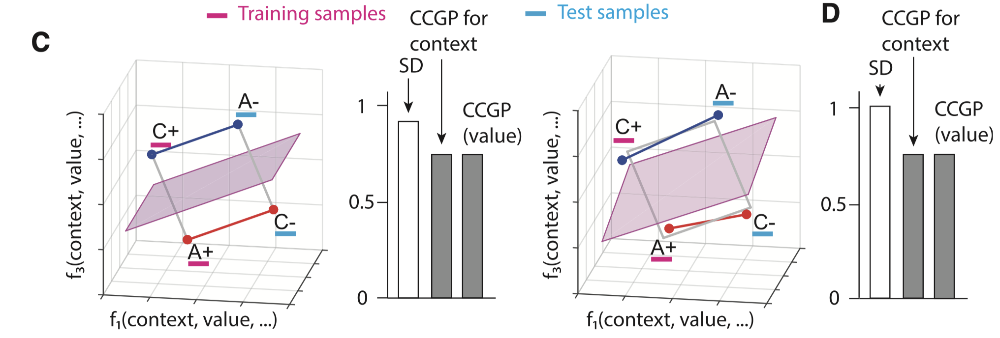

## Monkey Experiment Hypotheses (2)

<!-- _class: navbar -->
<!-- transition: cover -->
<!-- _header: \ ***@ SNU CN*** *Introduction* *In Silico* **In Vivo** *Individuals* *Conclusion*-->

1. Which variables are represented in each area of the brain?
2. Which variables are represented in **abstract format**, as quantified by CGCGP?
3. Does our brain use a *perfectly facotrized representation* or does it use a *twisted square* representation?
4. Do different areas of our brain represent different values at different speeds?
5. Does CCGP accurately correlate with accuracy, i.e. is there an abstract context representation in the brain?


## Monkey Experiment Results (1) 

<!-- _class: navbar -->
<!-- transition: cover -->
<!-- _header: \ ***@ SNU CN*** *Introduction* *In Silico* **In Vivo** *Individuals* *Conclusion*-->

1. Which variables are represented in each area of the brain?
   - In both the first and second epochs, all random dichotomies ($35$ of them) can be decoded using a linear classifier, implying a high shattering dimensionality (SD), and indicates all variables are well represented in ACC, DLPFC and HPC.

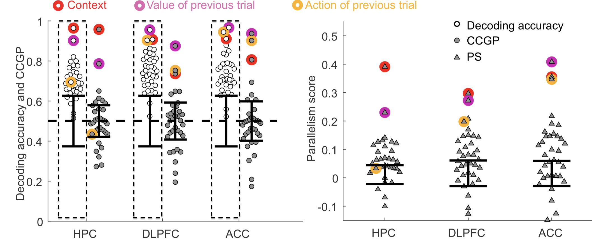

## Monkey Experiment Results (1) 

<!-- _class: navbar -->
<!-- transition: cover -->
<!-- _header: \ ***@ SNU CN*** *Introduction* *In Silico* **In Vivo** *Individuals* *Conclusion*-->

1. Which variables are represented in each area of the brain?
   - In both the first and second epochs, all random dichotomies ($35$ of them) can be decoded using a linear classifier, implying a high shattering dimensionality (SD), and indicates all variables are well represented in ACC, DLPFC and HPC.


## Monkey Experiment Results (2)

<!-- _class: navbar -->
<!-- transition: cover -->
<!-- _header: \ ***@ SNU CN*** *Introduction* *In Silico* **In Vivo** *Individuals* *Conclusion*-->

2. Which variables are represented in **abstract format**, as quantified by CGCGP?
   - In the first epoch, *action* is represented weakly in the HPC as an abstract format (shown in both CCGP and PS), perhaps indicating a weaker part in the decision making process.


## Monkey Experiment Results (2)

<!-- _class: navbar -->
<!-- transition: cover -->
<!-- _header: \ ***@ SNU CN*** *Introduction* *In Silico* **In Vivo** *Individuals* *Conclusion*-->

2. Which variables are represented in **abstract format**, as quantified by CGCGP?
   - In the first epoch, *action* is represented weakly in the HPC as an abstract format (shown in both CCGP and PS), perhaps indicating a weaker part in the decision making process.

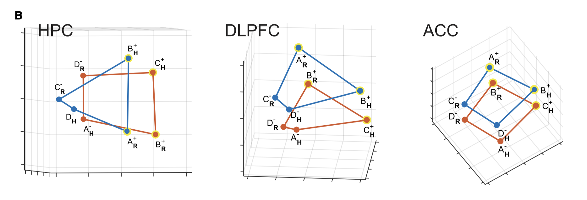

## Monkey Experiment Results (2)

<!-- _class: navbar -->
<!-- transition: cover -->
<!-- _header: \ ***@ SNU CN*** *Introduction* *In Silico* **In Vivo** *Individuals* *Conclusion*-->

2. Which variables are represented in **abstract format**, as quantified by CGCGP?
   - In the first epoch, *action* is represented weakly in the HPC as an abstract format (shown in both CCGP and PS), perhaps indicating a weaker part in the decision making process.
   - In the second epoch, *context* is more persistent in the HPC compared to the DLPFC, which may be related to hippocampus's role in memory formation.


## Monkey Experiment Results (2)

<!-- _class: navbar -->
<!-- transition: cover -->
<!-- _header: \ ***@ SNU CN*** *Introduction* *In Silico* **In Vivo** *Individuals* *Conclusion*-->

2. Which variables are represented in **abstract format**, as quantified by CGCGP?
   - In the first epoch, *action* is represented weakly in the HPC as an abstract format (shown in both CCGP and PS), perhaps indicating a weaker part in the decision making process.
   - In the second epoch, *context* is more persistent in the HPC compared to the DLPFC, which may be related to hippocampus's role in memory formation.

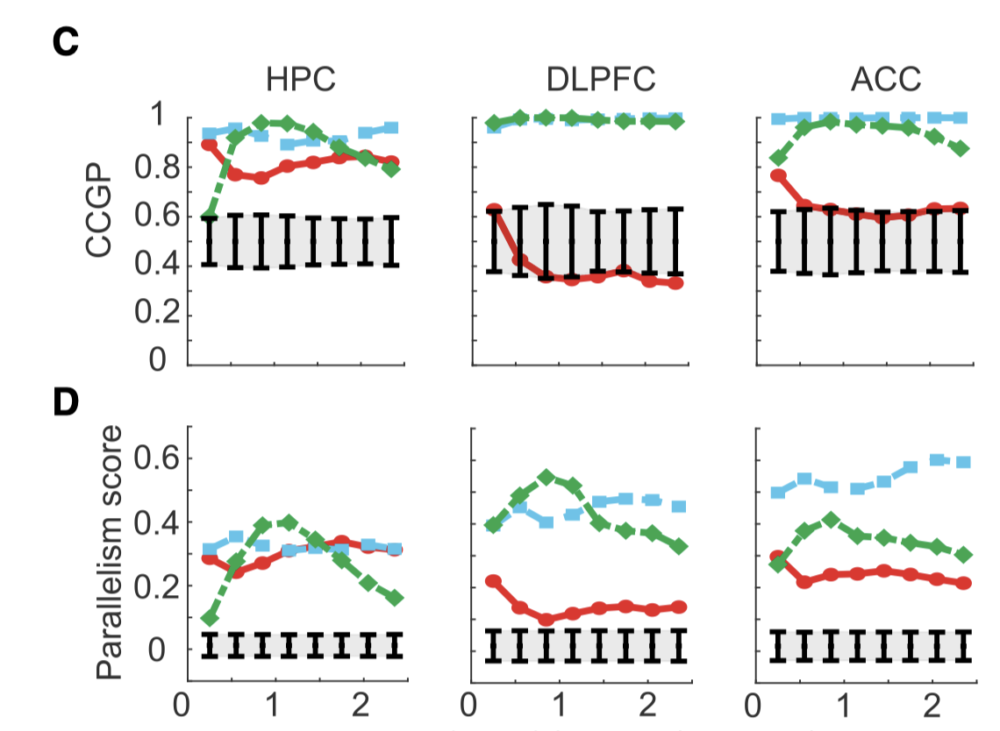

## Monkey Experiment Results (3)

<!-- _class: navbar -->
<!-- transition: cover -->
<!-- _header: \ ***@ SNU CN*** *Introduction* *In Silico* **In Vivo** *Individuals* *Conclusion*-->

3. Does our brain use a *perfectly facotrized representation* or does it use a *twisted square* representation?
    - All brain areas use a *twisted square* representation, which a higher shattering dimensionality (SD) in $\textcolor{gray}{\blacksquare}$ sthan a perfectly factorized representation, shown in $\circ$

 

## Monkey Experiment Results (3)

<!-- _class: navbar -->
<!-- transition: cover -->
<!-- _header: \ ***@ SNU CN*** *Introduction* *In Silico* **In Vivo** *Individuals* *Conclusion*-->

3. Does our brain use a *perfectly facotrized representation* or does it use a *twisted square* representation?
    - All brain areas use a *twisted square* representation, which a higher shattering dimensionality (SD) in $\textcolor{gray}{\blacksquare}$ sthan a perfectly factorized representation, shown in $\circ$
    


## Monkey Experiment Results (4)

<!-- _class: navbar -->
<!-- transition: cover -->
<!-- _header: \ ***@ SNU CN*** *Introduction* *In Silico* **In Vivo** *Individuals* *Conclusion*-->

4. Do different areas of our brain represent different values at different speeds?
    - The decoding value for action and performance rises the most slowly in the HPC, indicating that the signals representing decisions and performance are not first represented in the HPC. 
    
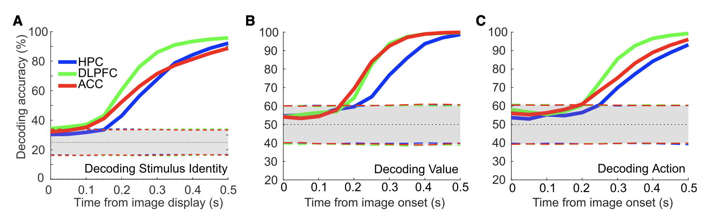

## Monkey Experiment Results (5)

<!-- _class: navbar -->
<!-- transition: cover -->
<!-- _header: \ ***@ SNU CN*** *Introduction* *In Silico* **In Vivo** *Individuals* *Conclusion*-->

5. Does CCGP accurately correlate with accuracy, i.e. is there an abstract context representation in the brain?
    - CCGP accurately correlates with accuracy, being higher in **correct** trials than in **incorrect** trials. 
    - Meanwhile, the decoding accuracy alone fails to accurately predict behavioral accuracy.  
    - This suggests that the brain uses an abstract context representation to make decisions. 
    
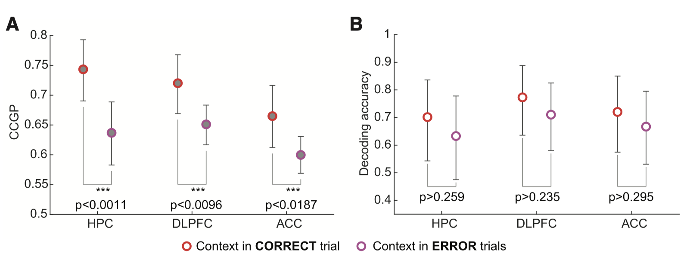

## 4. Methods (additional)

<!-- _class: trans -->
<!-- transition: melt -->
<!-- _footer: "" -->
<!-- _paginate: "" -->

## What is the additional paper about?

<!-- _class: navbar -->
<!-- transition: cover -->
<!-- _header: \ ***@ SNU CN*** *Introduction* *In Silico* *In Vivo* **Individuals** *Conclusion*-->

- Two rhesus monkeys showed nearly identical performance but different reaction times.
- A difference in representational geometry was found to underly this difference.
- In recurrent neural networks, correlated with the amount of training.
- In other words, abstract representational geometries begets behavior.


<div style="text-align: center; font-size: 12px;">
(The Zuckerman Institute, "Scientists Capture Clearest Glimpse of How Brain Cells Embody Thought", published in August 2024, retrieved on August 2025)
</div>

## How was the experiment conducted? 

<!-- _class: navbar -->
<!-- transition: cover -->
<!-- _header: \ ***@ SNU CN*** *Introduction* *In Silico* *In Vivo* **Individuals** *Conclusion*-->

- Both monkeys were trained to perform a visually cued rule-based task to choose one of two spatial targets with there eyes.
- The single-unit recordings were performed in the dorsolateral prefrontal cortex (DLPFC). 


## What differences were there between the monkeys? (1)

<!-- _class: navbar cols-2-->
<!-- transition: cover -->
<!-- _header: \ ***@ SNU CN*** *Introduction* *In Silico* *In Vivo* **Individuals** *Conclusion*-->

- In both monkeys, high performance for the task was found. The $\textcolor{green}{\text{previous response}}$ was not stored in abstract format, and the $\textcolor{red}{\text{current response}}$ was well represented in abstract format.
- $\textcolor{#FAB52F}{\text{Shape}}$ had the highest CCGP in Monkey 1, while the $\textcolor{blue}{\text{rule}}$ had the highest CCGP in Monkey 2. 
- TMonkey 1 is grouping together the cues with the same shape, while Monkey 2 is grouping together the visual cues that correspond to the same rule. 


## What differences were there between the monkeys? (2)

<!-- _class: navbar row-2-->
<!-- transition: cover -->
<!-- _header: \ ***@ SNU CN*** *Introduction* *In Silico* *In Vivo* **Individuals** *Conclusion*-->

- Using a non-linear decoding and MDS, the differences become even more striking.


## Geometry explains reaction times (1)

<!-- _class: navbar row-2-->
<!-- transition: cover -->
<!-- _header: \ ***@ SNU CN*** *Introduction* *In Silico* *In Vivo* **Individuals** *Conclusion*-->

- A more detailed analysis, including reaction times demonstrates that while the shape of the visual cue impacted performance significantly in Monkey 1, rule impacted performance significantly in Monkey 2.


## Geometry explains reaction times (2)

<!-- _class: navbar row-2-->
<!-- transition: cover -->
<!-- _header: \ ***@ SNU CN*** *Introduction* *In Silico* *In Vivo* **Individuals** *Conclusion*-->

- A more detailed analysis, including reaction times demonstrates that while the shape of the visual cue impacted performance significantly in Monkey 1, rule impacted performance significantly in Monkey 2.

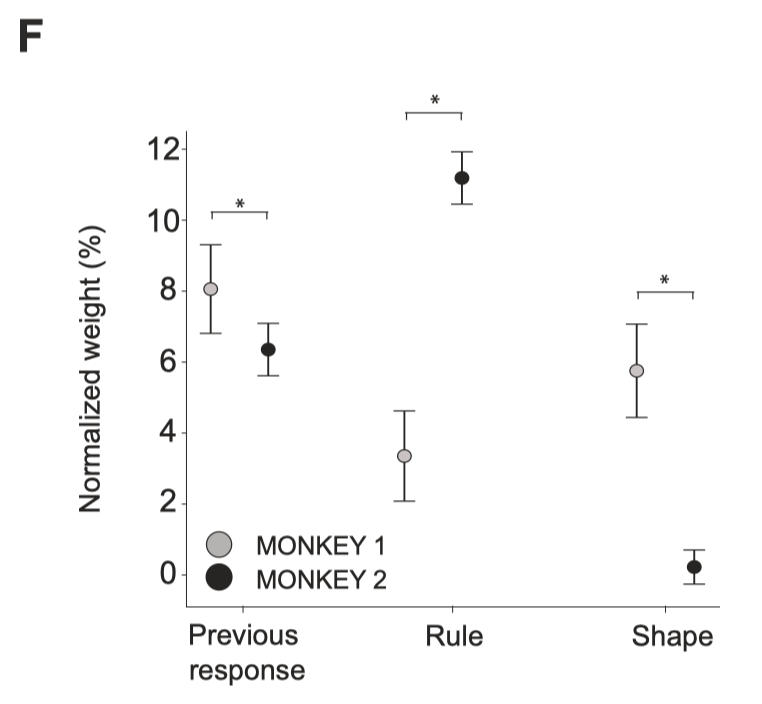

## The behavioral difference is replicated in RNNs (1)

<!-- _class: navbar row-2-->
<!-- transition: cover -->
<!-- _header: \ ***@ SNU CN*** *Introduction* *In Silico* *In Vivo* **Individuals** *Conclusion*-->

- 80 different RNN models with 100 ReLU units were trained to reproduce the behavior of the monkeys.
- The proximal-policy optimization algoirthm was used to train the reinforcement learning task.
- Learning was terminated when $\geq 99\%$ of tasks were completed and $\geq 90\%$ accuracy was reached.


## The behavioral difference is replicated in RNNs (2)

<!-- _class: navbar row-2-->
<!-- transition: cover -->
<!-- _header: \ ***@ SNU CN*** *Introduction* *In Silico* *In Vivo* **Individuals** *Conclusion*-->

- Consistently, RNN models with less training trials showed a CCGP, $\Delta$-decoding, and reaction times ($\Delta RT$) more dependent on shape. **Net 1** and **Net 2** exemplify this difference.
- This is consistent with the experiment with the monkeys. (with Monkey 1 having less training)

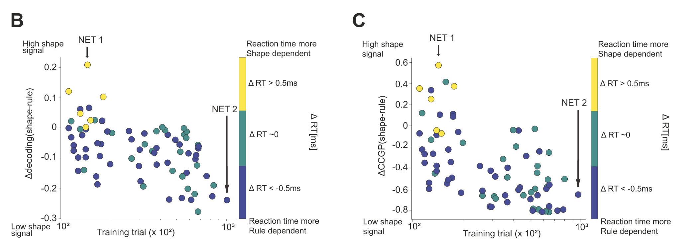

## The behavioral difference is replicated in RNNs (3)

<!-- _class: navbar row-2-->
<!-- transition: cover -->
<!-- _header: \ ***@ SNU CN*** *Introduction* *In Silico* *In Vivo* **Individuals** *Conclusion*-->

- An analysis of CCGP and accuracy across time demonstrates **shape** determined neuron firing in **Net 1**, while **rule** determined neuron firing in **Net 2**.

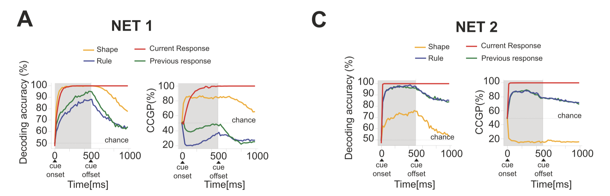

## The behavioral difference is replicated in RNNs (4)

<!-- _class: navbar row-2-->
<!-- transition: cover -->
<!-- _header: \ ***@ SNU CN*** *Introduction* *In Silico* *In Vivo* **Individuals** *Conclusion*-->

- RT was determined by shape in **Net 1**, while RT was determined by rule in **Net 2**.


## The behavioral difference is replicated in RNNs (5)

<!-- _class: navbar row-2-->
<!-- transition: cover -->
<!-- _header: \ ***@ SNU CN*** *Introduction* *In Silico* *In Vivo* **Individuals** *Conclusion*-->

- A multiple linear regression analysis of RT showed similar patterns between the monkeys and the RNNs.


## The behavioral difference is replicated in RNNs (6)

<!-- _class: navbar row-2-->
<!-- transition: cover -->
<!-- _header: \ ***@ SNU CN*** *Introduction* *In Silico* *In Vivo* **Individuals** *Conclusion*-->

- The distributions of RTs were generally smaller in Network 2, perhaps indicating a more efficient strategy.
- The reaction time was significantly faster in Monkey 2 than in Monkey 1.
- However, RNNs were not trained to match  monkeys, and interpretation should be done with caution. 

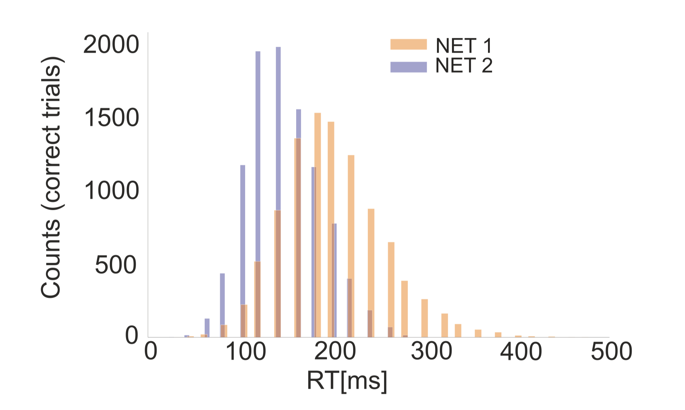

## 5. Discussion and Conclusion

<!-- _class: trans -->
<!-- transition: melt -->
<!-- _footer: "" -->
<!-- _paginate: "" -->

## Take Home Message 

<!-- _class: navbar-->
<!-- transition: cover -->
<!-- _header: \ ***@ SNU CN*** *Introduction* *In Silico* *In Vivo* *Individuals* **Conclusion**-->

- The brain uses an abstract geometric representation of the world to make decisions. Similar to a **twisted square**, it has both high dimensionality (=SD) and high abstraction (=CCGP).
- Orthogonal representations are used for different types of dichotomies in both **in silico** and **in vivo** experiments.
- The brain does not use a perfectly factorized representation; behavior is better prediced by CCGP than by decoding accuracy alone. 
- Different areas of the brain use different representations; hippocampus stores context more persistently than the frontal cortex, but is less involved in decision making.
- Abstract representational geometry explains learning and behavioral  differences between monkeys.
- Abstract representational geometry properties can be replicated with recurrent neural networks.

## Further Reading 1: Why Linear Separability?
<!-- _class: navbar-->
<!-- transition: cover -->
<!-- _header: \ ***@ SNU CN*** *Introduction* *In Silico* *In Vivo* *Individuals* **Conclusion**-->

- *Reference: Perceptual straightening of natural videos*

1. Is linear separability a good proxy for abstract representation?
   - The idea originated from disentanglement in the ventral visual stream. 
   - It is natural to extend this idea from segmentation to context recognition.

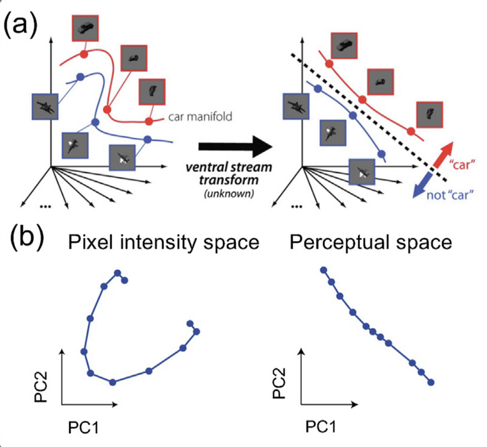

## Further Reading 2: Alternatives to MDS 
<!-- _class: navbar-->
<!-- transition: cover -->
<!-- _header: \ ***@ SNU CN*** *Introduction* *In Silico* *In Vivo* *Individuals* **Conclusion**-->

- *Reference: Geometry of abstract learned knowledge in the hippocampus*

2. MIND for Neural Dynamics
   - MDS preserves global distances but MIND (manifold inference for neural dynamics) may be more suitable for studying dynamic neural activity. 
   - MIND was previously used to reveal a 4-6 dimensional manifold of the hippocampus in a T maze navigation task. It could reveal properties like periodicity and symmetry in neural representations

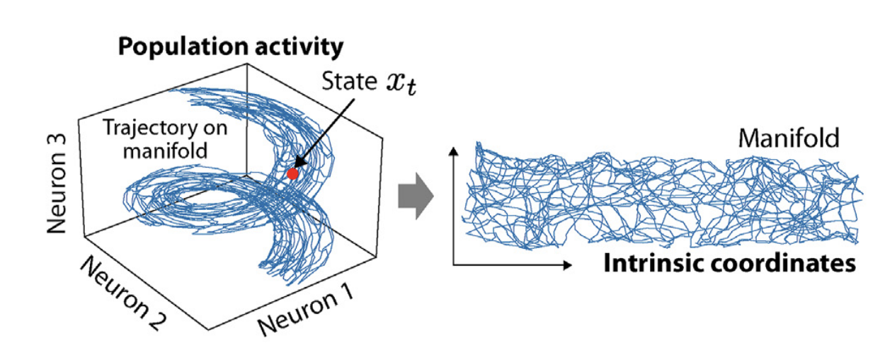

## References
<!-- _class: navbar-->
<!-- transition: cover -->
<!-- _header: \ ***@ SNU CN*** *Introduction* *In Silico* *In Vivo* *Individuals* **Conclusion**-->

[1]: Bernardi, S., Benna, M. K., Rigotti, M., Munuera, J., Fusi, S., & Salzman, C. D. (2020). The geometry of abstraction in the hippocampus and prefrontal cortex. Cell, 183(4), 954-967.
[2]: Fascianelli, V., Battista, A., Stefanini, F., Tsujimoto, S., Genovesio, A., & Fusi, S. (2024). Neural representational geometries reflect behavioral differences in monkeys and recurrent neural networks. Nature Communications, 15(1), 6479.
[3]: Chung, S., & Abbott, L. F. (2021). Neural population geometry: An approach for understanding biological and artificial neural networks. Current opinion in neurobiology, 70, 137-144.
[4]: Hénaff, O. J., Goris, R. L., & Simoncelli, E. P. (2019). Perceptual straightening of natural videos. Nature neuroscience, 22(6), 984-991.
[5]: Nieh, E. H., Schottdorf, M., Freeman, N. W., Low, R. J., Lewallen, S., Koay, S. A., ... & Tank, D. W. (2021). Geometry of abstract learned knowledge in the hippocampus. Nature, 595(7865), 80-84.
[6]: Low, R. J., Lewallen, S., Aronov, D., Nevers, R., & Tank, D. W. (2018). Probing variability in a cognitive map using manifold inference from neural dynamics. BioRxiv, 418939.

---

<!-- _class: lastpage -->
<!-- _footer: "" -->

###### Q&A


